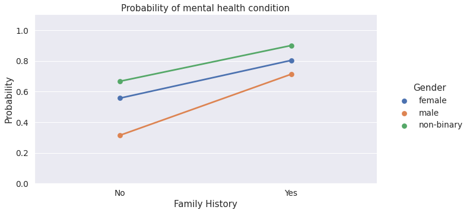
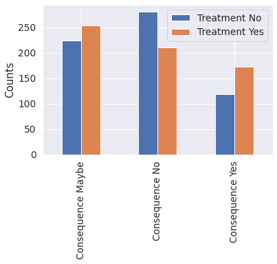
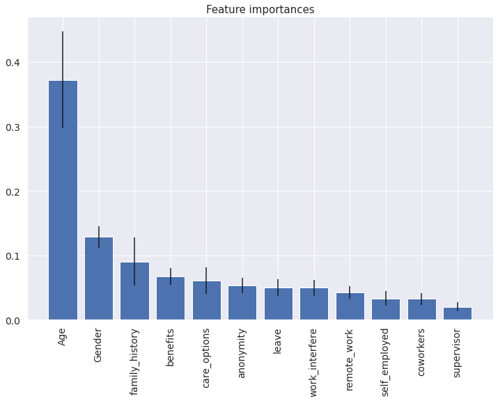

# Impact of the workplace environment on Mental Health

## Data 512 Project
## Kirti Kharb
### Abstract:
Mental health has become a serious concern in the 21st century. As people in technical jobs lead a sedentary lifestyle and have very few social engagements outside their workplace, It is important to study the factors in a workplace that affect an individual’s mental health. I want to know how employers can take measures to promote their employee’s mental health and spread awareness to address this growing concern. Aside from company policies with regard to health, leaves, insurance, etc., the ability to comfortably communicate health problems with colleagues and supervisors can have a serious impact on an employee’s mental health. In this project I make use of [OSMI Mental Health In Tech Survey 2014](https://www.kaggle.com/osmi/mental-health-in-tech-survey) data and answer four research questions:
- Q1: How does the frequency of mental health illness vary by age, gender, country?
- Q2. Does a family history of mental health illness impact the frequency of mental health illnesses?
- Q3. Does attitude towards mental health impact an individual’s decision to seek treatment for a mental health condition?
- Q4. What are the strongest predictors of mental health illness due to the workplace environment?

The steps followed in the analysis are as follows: preprocess data, normalize values of categorical columns, create new features, data encoding, exploratory data analysis and finally building a classification model using logistics regression and random forest classifier. I finally conclude the findings from data exploration and modeling with a discussion on results as well as their limitations. 

The entire methodology, analysis, visualizations, and results are recorded in this [IPython Notebook](./data512-project-notebook.ipynb)

### Datasets:
For this project, I use following dataset that is publicly available on [Kaggle](https://www.kaggle.com/).
- [OSMI Mental Health In Tech Survey 2014](https://www.kaggle.com/osmi/mental-health-in-tech-survey) licensed under [CC BY-SA 4.0](https://creativecommons.org/licenses/by-sa/4.0/)
The dataset is owned by [OSMI](https://osmihelp.org) and the contents of the website are also licensed under a [Creative Commons Attribution-ShareAlike 4.0 International License](https://creativecommons.org/licenses/by-sa/4.0/). It contains qualitative survey data conducted in the year 2019 about mental health in Tech and answers a range of questions about employers’ mental health policies along with candidates’ age, race, gender, and country of work and residence. 

This dataset contains all the necessary qualitative and quantitative information needed to analyze the problem at hand. Although the OSMI survey results are anonymized and do not contain PII, it still has sensitive demographic data(age, gender). The results of the analysis are purely to understand the factors affecting the mental health of people in tech and is not meant for disrespecting anyone.

All the raw data collected for the analysis is stored in [data/raw](./data/raw) folder.

### Data Dictionary
| Field | Description |
| --- | --- | 
| self_employed | Are you self-employed?|
remote_work | Do you work remotely (outside of an office) at least 50% of the time?
tech_company | Is your employer primarily a tech company/organization?
anonymity | Is your anonymity protected if you choose to take advantage of mental health or substance abuse treatment resources?
leave | How easy is it for you to take medical leave for a mental health condition?
coworkers | Would you be willing to discuss a mental health issue with your coworkers?
supervisor | Would you be willing to discuss a mental health issue with your direct supervisor(s)?
treatment | Have you sought treatment for a mental health condition?
benefits | Does your employer provide mental health benefits?
care_options | Do you know the options for mental health care your employer provides?
wellness_program | Has your employer ever discussed mental health as part of an employee wellness program?
seek_help | Does your employer provide resources to learn more about mental health issues and how to seek help?
mental_health_consequence | Do you think that discussing a mental health issue with your employer would have negative consequences?
family_history | Do you have a family history of mental illness?
work_interfere | Whether having a mental illness causes interference in work?
treatment | Have you sought treatment for a mental health condition?

### Unknowns and dependencies:

The Mental Health in Tech Survey data is skewed in the sense that the majority of survey participants are from the US and very few from low-income countries. The survey has answers from 1259 participants about 26 questions. The small sample size and skewness will create problems in making any strong claims on whether the region/country affects the mental health of people working there. It does not appear that the survey was administered to a representative sample and so, we won't be able to generalize the findings to a broader population. Also, as it is qualitative data, the analysis will heavily depend on the range of options for each categorical question. There might not be sufficient objectivity and also some bias in data collection steps. The variable, treatment (Have you sought treatment for a mental health condition?) may not be representative of the fact that whether individual suffers from a mental illness. 

### Visualizations 

**Figure 1:** Probability of mental health condition with respect to family-history and gender.

**Figure 2:** Frequency of seeking treatment with respect to `mental_health_consequence`

**Figure 3:** Features in the order of their importance to classify whether an individual seeks treatment for a mental health condition

### Findings
- The probability of developing a mental health condition depends on personal factors like age, gender, and whether or not an individual has a family history of such conditions.
- We observe that females and non-binary genders have more probability to develop a mental health condition than males.
- Having a family history of mental health conditions increases the odds to have a mental health illness.
- Although we see different distributions in the frequency of having a mental health condition by country, state, and region, we cannot make any strong claims whether on not a geographical location has an impact on an individual's mental health because we do not have enough data points.
- We see that having a negative consequence of discussing a mental health issue with an employer impacts an individual's decision to seek treatment.
- Positive Workplace attitudes and policies below will contribute to bettering the mental health of employees.
  - Providing employees with medical benefits, care options, resources, and awareness about these programs.
  - Creating a safe place to discuss mental issues with supervisors and peers.
  - Protecting the anonymity of individuals seeking help.
  - Creating an environment of trust with employees and ensuring that they won’t suffer the negative consequences of having a mental illness.
 
 ### References

1. [Pandey, Shambhavi, et al. “Factors Affecting Mental Health in Employees and Their Relation to Suicide Rates at a Workplace.”]( https://www.sas.com/content/dam/SAS/support/en/sas-global-forum-proceedings/2019/3966-2019.pdf)

2. [InfoQ articles](https://www.infoq.com/articles/mental-health-tech-workplace/)

3. [OSMI Research blog](https://osmihelp.org/research)

### License
This code is available under the [MIT License](./LICENSE).

The dataset [OSMI Mental Health In Tech Survey 2014](https://www.kaggle.com/osmi/mental-health-in-tech-survey) is available under [CC BY-SA 4.0](https://creativecommons.org/licenses/by-sa/4.0/).

### Terms of Use
By using the data and source code in this repository, you agree to their respective licenses. 

